# coupon-concurrency-lab — 선착순 쿠폰 발급 동시성 제어, 실측 비교

쿠폰 100개에 서로 다른 사용자 1,000명이 동시에 몰릴 때 **초과 발급·중복 발급이 0건**이면서 응답시간과 처리량이 합리적인 구현을
락 없음 → 비관적 락 → 낙관적 락 → 조건부 UPDATE 순으로 **같은 환경에서 재현 가능한 실험**으로 골랐다.
모든 숫자는 이 저장소의 스크립트로 다시 측정할 수 있고, 예상치는 쓰지 않았다.

- 측정 결과 전체(자동 생성): [`docs/results.md`](docs/results.md)
- 실험 기록(양식별): [`docs/experiments/`](docs/experiments/)
- 메트릭·Prometheus·Grafana 패널: [`docs/metrics.md`](docs/metrics.md)
- 그래프: [`docs/charts/`](docs/charts/)
- 웹 UI(React): [`web/`](web/) — 브라우저에서 네 전략을 직접 실행해 초과 발급을 눈으로 확인하고, 실측 결과 표·그래프를 본다 (아래 4절)
- 원시 데이터: `results/<실험>/runs.jsonl` (실행 1건 = JSON 1줄), `results/<실험>/raw/` (k6 요약, 전후 스냅샷, SQL 다이제스트)

## 1. 구조

```text
k6 (호스트) ─HTTP─▶ Spring Boot 4.1 / Java 21 (호스트, Tomcat 200 스레드, HikariCP 20)
                        └─JDBC─▶ MySQL 8.0.46 (Docker, 4 vCPU / 1.5 GiB, REPEATABLE READ, flush_log_at_trx_commit=1)
Prometheus(1s) ◀─ /actuator/prometheus, mysqld-exporter ─▶ Grafana
```

| 구성 | 내용 |
|---|---|
| 호스트 | Apple M5, 10코어, 32 GB, macOS (Darwin 25.6) — 앱·k6·Docker VM 이 한 장비에서 실행됨 |
| 앱 | Spring Boot 4.1.0, Java 21.0.2, `JdbcTemplate` + `TransactionTemplate`, JVM `-Xms1g -Xmx1g -XX:+UseG1GC -XX:+AlwaysPreTouch` |
| DB | `mysql:8.0` (8.0.46), `performance_schema=ON`, `max_connections=500`, `innodb_buffer_pool_size=512M`, 컨테이너 제한 cpus=4 / 1536 MiB |
| 커넥션 풀 | HikariCP `maximum-pool-size=minimum-idle=20` (고정 크기), `connection-timeout=30s`, `auto-commit=false` |
| 웹 | Tomcat `threads.max=200`, `accept-count=1000` |
| 부하 | k6 v2.1.0, 스크립트 1개(`k6/issue.js`), 환경변수로 전략·VU·모드만 변경 |
| 웹 UI | `web/` React 19 + Vite 8 (:5180, `/api` 를 8080 으로 프록시). 시연용 실행기 `DemoController`(`/api/demo/run`) 가 자기 API 를 가상 스레드로 N건 호출한 뒤 DB 를 세어 응답과 대조. 정식 수치는 k6 실측만 사용 |
| 스키마 | `coupon(id, total_quantity, issued_quantity, version)`, `coupon_issue(coupon_id, user_id, UNIQUE(coupon_id,user_id))` |

## 2. 네 가지 구현 (`src/main/java/com/seongmin/coupon/CouponIssueService.java`)

모든 전략은 "coupon 1행 읽기/갱신 + coupon_issue 1행 INSERT"를 한 트랜잭션으로 수행하고, 중복은 UNIQUE 제약 위반(`DuplicateKeyException`)으로 409 처리한다.
응답: 200 ISSUED / 410 SOLD_OUT / 409 DUPLICATE / 503 RETRY_EXHAUSTED / 500 오류.

| 전략 | 핵심 SQL | 특징 |
|---|---|---|
| 락 없음 (`no-lock`) | `SELECT issued …` → 검사 → `INSERT issue` → `UPDATE coupon SET issued_quantity = <읽은 값+1>` | JPA 더티체킹이 만드는 절대값 UPDATE. 읽기-검사-쓰기 사이가 보호되지 않아 lost update + 초과 발급 |
| 비관적 락 (`pessimistic`) | `SELECT … FOR UPDATE` → 검사 → `INSERT issue` → `UPDATE … +1` | 행 X-락을 SELECT 시점부터 COMMIT 까지 보유. 품절 판정도 락을 잡고 함 |
| 낙관적 락 (`optimistic`) | `SELECT … version` → 검사 → `INSERT issue` → `UPDATE … SET version=version+1 WHERE version=?` | 0행이면 충돌 → 트랜잭션 롤백 후 새 트랜잭션으로 재시도(최대 20회, 백오프 없음). 소진 시 503 |
| 조건부 UPDATE (`conditional`) | `SELECT`(무잠금 선조회, 품절이면 즉시 410) → `INSERT issue` → `UPDATE coupon SET issued_quantity=issued_quantity+1 WHERE id=? AND issued_quantity<total_quantity` | 검사와 증가를 한 문장으로 원자화. UPDATE 를 트랜잭션 맨 끝에 두어 핫로우 락 보유 구간을 "UPDATE~COMMIT"으로 최소화. 0행이면 롤백 후 410 |

낙관적 락과 조건부 UPDATE 모두 "무잠금 선조회로 품절을 걸러내는" 빠른 경로가 있고, 비관적 락은 구조상 그 경로에도 락이 걸린다. 이 차이가 품절 이후 트래픽(전체의 90%)의 처리량 차이로 나타난다.

## 3. 실험 설계

| 실험 | 쿠폰 수량 | 부하 모델 | 동시 사용자 | 목적 |
|---|---|---|---|---|
| `coherence` | 100 | 서로 다른 사용자 1,000명, 요청 1,000건 고정 (k6 shared-iterations) | 10·50·100·200·500·1,000 | 정합성 + 선착순 시나리오 성능 |
| `sustained` | 10,000,000 (품절 없음) | 10초 지속 (constant-vus), 매 요청 새 사용자 | 10·50·100·200·500·1,000 | 발급 가능 상태의 순수 처리량·병목 |
| `soldout` | 0 | 10초 지속 | 100·1,000 | 품절 상태 처리 성능 |
| `duplicate` | 100 | 사용자 1,000명이 각 2회, 요청 2,000건 | 1,000 | 중복 차단 검증 |
| `poolsize` | 10,000,000 | 10초 지속 | 200 | HikariCP 10/20/50 과 처리량 |
| `nounique` | 100 | duplicate 와 동일, UNIQUE 제약 제거 | 1,000 | 제약 없을 때 중복 발급 재현 |

통제: 같은 장비·JVM 옵션·MySQL 설정·풀 크기·데이터셋·k6 스크립트. 실행마다 `TRUNCATE coupon_issue`, `issued_quantity=0`, `performance_schema` 다이제스트 초기화.
전략별 워밍업 1회(200 VU) 후 **구현별 5회 반복**, 반복마다 전략 실행 순서를 회전(1회차 A B C D, 2회차 B C D A …)해 순서 효과를 상쇄.
표의 대표값은 중앙값이고 5회 값·최소·최대·표준편차·변동계수는 `docs/results.md` 4절에 있다.

측정 출처: 요청 지표는 k6 요약, DB 진실값은 실행 전후 `SHOW GLOBAL STATUS`/`INNODB_METRICS`/`events_statements_summary_by_digest` 차분과 검증 쿼리, 시계열은 Prometheus. 자세한 것은 `docs/metrics.md`.

## 4. 실행 방법

```bash
docker compose up -d                 # MySQL, mysqld-exporter, Prometheus(:9090), Grafana(:3000, 익명 Admin)
./gradlew bootJar
bench/app.sh start                   # HIKARI_POOL_SIZE, TOMCAT_MAX_THREADS, OPTIMISTIC_MAX_RETRIES 환경변수로 조정
REPS=1 LEVELS="100" bench/run.sh coherence   # 파이프라인 확인(스모크)
bench/all.sh && bench/all2.sh        # 전체 실험 (약 1시간)
python3 -m venv .venv && .venv/bin/pip install matplotlib
.venv/bin/python bench/report.py     # docs/results.md, docs/charts/*.png, results/summary.json 생성
cd web && npm install && npm run dev # 웹 UI http://localhost:5180 (앱 8080 이 떠 있어야 직접 실행이 된다)
```

포트: 웹 UI 5180, 발급 API 8080, Grafana 3000, Prometheus 9090, mysqld-exporter 9104, MySQL 3306.

단일 실행: `STRATEGY=conditional VUS=1000 MODE=iterations ITERATIONS=1000 k6 run k6/issue.js`.

## 5. 결과 요약 (5회 반복 중앙값, 전부 실측)

### 5.1 정합성 — 쿠폰 100개 / 서로 다른 사용자 1,000명 / 동시 사용자 1,000명 (EXP-01)

| 구현 방식 | 성공 응답 | DB 발급 건수 | 발급 수량 | 초과 발급 | 중복 발급 | 응답-DB 불일치 | 재고-발급 불일치 | 정합성 |
|---|---:|---:|---:|---:|---:|---:|---:|---|
| 락 없음 | 1,000 | 1,000 | 52 [50–57] | 900 | 0 | 0 | 948 [943–950] | ❌ 실패 |
| 비관적 락 | 100 | 100 | 100 | 0 | 0 | 0 | 0 | ✅ 성공 |
| 낙관적 락 | 100 | 100 | 100 | 0 | 0 | 0 | 0 | ✅ 성공 |
| 조건부 UPDATE | 100 | 100 | 100 | 0 | 0 | 0 | 0 | ✅ 성공 |

동시 사용자 10·50·100·200·500·1,000 전 단계 × 5회에서 같은 결과였다(`docs/results.md` 1절). 락 없음은 10 VU 에서도 1,000건 전부 발급된다:
재고 검사가 스냅샷 값을 보고, UPDATE 가 절대값이라 동시 갱신이 서로를 덮어쓴다(issued_quantity 는 52 에서 멈춤).

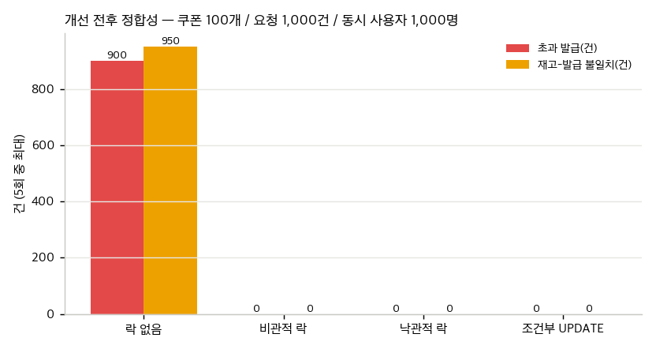

### 5.2 성능 — 같은 시나리오, 동시 사용자 1,000명

| 구현 방식 | 전체 TPS | 성공 처리 TPS | p50 | p95 | p99 | 5xx | 서버 오류율 | 커넥션 획득 평균 | 행 잠금 대기 횟수 / 평균 / 합계 |
|---|---:|---:|---:|---:|---:|---:|---:|---:|---:|
| 락 없음 | 862.5 | (부정확) | 560.5 ms | 996.6 ms | 1,044.5 ms | 0 | 0% | 175.7 ms | 999 / 20.3 ms / 20,265 ms |
| 비관적 락 | 2,589.8 | 259.0 | 209.8 ms | 261.1 ms | 262.8 ms | 0 | 0% | 52.9 ms | 999 / 6.05 ms / 6,047 ms |
| 낙관적 락 | 1,259.1 | 125.9 | 642.3 ms | 684.1 ms | 701.9 ms | 38 | 3.80% | 45.0 ms | 1,994 / 4.72 ms / 9,421 ms |
| 조건부 UPDATE | 3,442.4 | 344.2 | 151.0 ms | 194.7 ms | 204.5 ms | 0 | 0% | 35.3 ms | 118 / 25.6 ms / 3,016 ms |

성공 처리 TPS = 성공 발급 100건 / 1,000건 처리 시간. 낙관적 락의 5xx 는 전부 재시도 20회 소진(503)이며 충돌 1,895회·재시도 1,856회가 그 뒤에 있다.

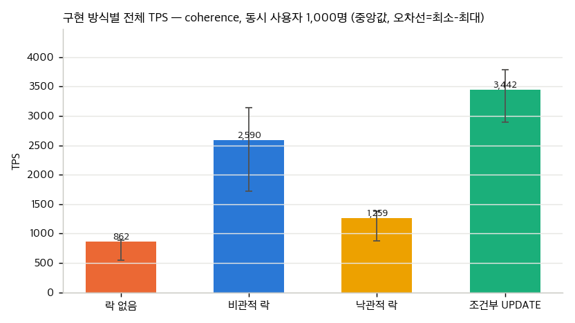
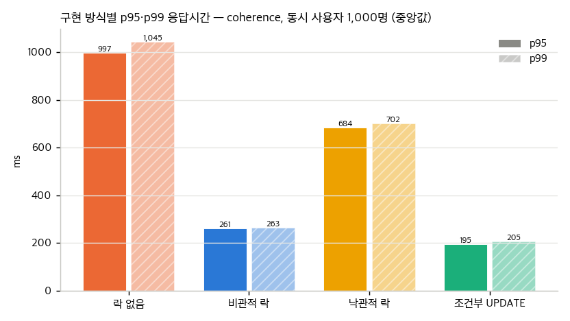
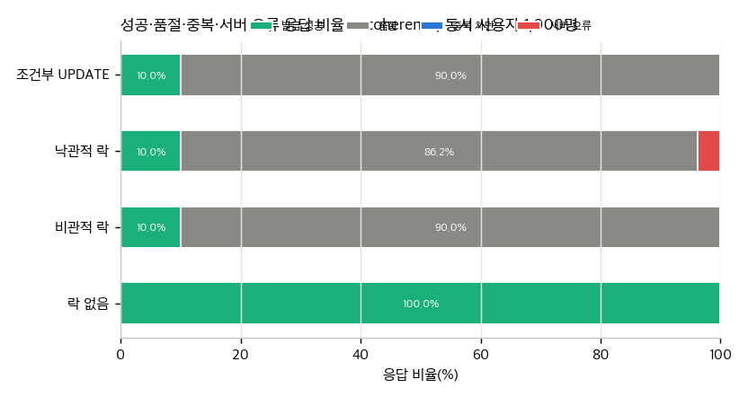

### 5.3 개선율 — 변경 전 = 비관적 락(정합성이 보장되는 첫 구현), 변경 후 = 조건부 UPDATE

```text
기준 구현의 측정값   비관적 락, 1,000 VU: 2,589.8 TPS, p95 261.1 ms, p99 262.8 ms, 행 잠금 대기 999회(합계 6,047 ms), 커넥션 획득 52.9 ms
→ 병목 원인          품절 응답 900건까지 SELECT ... FOR UPDATE 로 핫로우를 잠근다. 잠금 보유 구간이 SELECT~COMMIT 전체.
→ 변경한 코드        무잠금 SELECT 로 품절을 먼저 걸러내고, INSERT 후 마지막에 UPDATE ... WHERE issued_quantity < total_quantity 로
                     검사와 증가를 원자화 (CouponIssueService.conditional)
→ 동일 조건 재측정   3,442.4 TPS, p95 194.7 ms, p99 204.5 ms, 행 잠금 대기 118회(합계 3,016 ms), 커넥션 획득 35.3 ms
→ 개선율             아래 표
→ 부작용과 한계      잠금 1회당 평균 대기는 6.05 → 25.6 ms 로 늘었다(대기가 실제 UPDATE~COMMIT 구간에만 생기므로). 품절 경계에서 INSERT 후 롤백 19회.
```

| 지표 | 변경 전 (비관적 락) | 변경 후 (조건부 UPDATE) | 변화 |
|---|---:|---:|---:|
| TPS | 2,589.8 | 3,442.4 | +32.9% |
| 성공 처리 TPS | 259.0 | 344.2 | +32.9% |
| p95 응답시간 | 261.1 ms | 194.7 ms | −25.4% |
| p99 응답시간 | 262.8 ms | 204.5 ms | −22.2% |
| 오류율 | 0.00% | 0.00% | 0.00%p |
| 평균 락 대기시간 (대기 1회당) | 6.05 ms | 25.56 ms | +322% |
| 락 대기시간 합계 | 6,047 ms | 3,016 ms | −50.1% |
| 커넥션 획득 대기 평균 | 52.85 ms | 35.31 ms | −33.2% |
| 초과 발급 | 0 | 0 | 0건 달성 |
| 중복 발급 | 0 | 0 | 0건 달성 |

지속 부하(재고 무제한, EXP-05) 1,000 VU 에서는 TPS 622.8 → 1,132.0 (+81.8%), p95 3,315.7 → 1,817.3 ms (−45.2%), p99 3,483.8 → 1,887.5 ms (−45.8%), 평균 락 대기 30.16 → 16.07 ms (−46.7%).
200 VU 에서는 TPS +24.4%, p95 −7.7% 지만 p99 는 +15.1% 로 나빠졌다 — 편차 안의 차이라 성공 경로만 있는 부하에서 두 방식의 차이는 작다고 본다.
락 없음 → 조건부 UPDATE 는 TPS +299%, p95 −80.5% 지만 락 없음은 정합성이 깨진 구현이라 기준선으로 쓰지 않았다.

### 5.4 병목 구간 (EXP-05, 재고 무제한 10초 지속, 조건부 UPDATE 기준)

```text
동시 사용자 10명에서 이미 요청마다 행 잠금 대기 1회(평균 13.6 ms)가 발생한다 — 핫로우 1행의 UPDATE~COMMIT 직렬화가 응답시간의 대부분이며 623 TPS ≈ 1건당 1.6 ms.
50명부터 HikariCP 풀(20)을 넘겨 커넥션 획득 대기 64.5 ms, 대기 커넥션 30, 행 잠금 대기 평균 40.4 ms 가 되고 p95 는 24.2 → 222.0 ms(9배)로 뛴다. TPS 는 462 로 오히려 준다.
100~200명에서는 커넥션 획득 대기 118 → 205 ms, 대기 커넥션 80 → 179, p95 303 → 621 ms. TPS 는 666 → 855 로 늘어난다.
500명에서는 대기 커넥션이 179 에서 멈춘다 — Tomcat 스레드 200 이 상한이라 나머지는 Tomcat 큐에서 기다린다. 커넥션 획득 대기는 204 ms 로 같은데 p95 는 2,051 ms(3.3배)로 꺾인다.
1,000명에서는 p95 조건부 1,817 ms / 비관적 3,316 ms, TPS 1,132 / 623. 낙관적 락은 전 구간 5xx 30~66%, MySQL CPU 65~107%.
```

| VU | 조건부 TPS | 조건부 p95 | 커넥션 획득 평균 | 대기 커넥션 max | 행 잠금 대기 평균 | 낙관적 락 충돌(10초) | 낙관적 락 5xx |
|---:|---:|---:|---:|---:|---:|---:|---:|
| 10 | 622.8 | 24.2 ms | 0.00 ms | 0 | 13.58 ms | 21,578 | 1,014 |
| 50 | 462.0 | 222.0 ms | 64.51 ms | 30 | 40.38 ms | 26,177 | 1,131 |
| 100 | 665.6 | 302.7 ms | 118.34 ms | 80 | 27.91 ms | 30,474 | 1,428 |
| 200 | 855.3 | 621.2 ms | 204.78 ms | 179 | 21.70 ms | 29,589 | 1,357 |
| 500 | 872.3 | 2,050.8 ms | 204.32 ms | 179 | 21.22 ms | 29,543 | 1,364 |
| 1,000 | 1,132.0 | 1,817.3 ms | 156.82 ms | 179 | 16.07 ms | 40,319 | 1,874 |

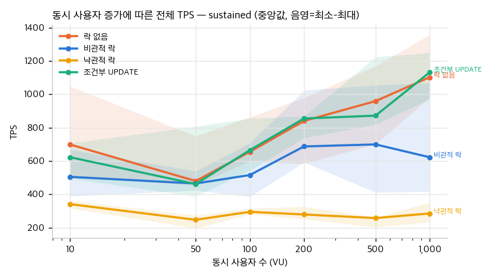
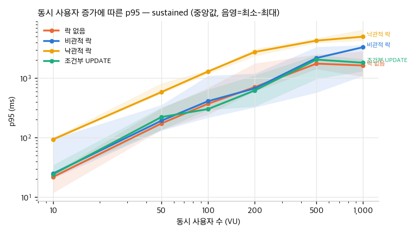
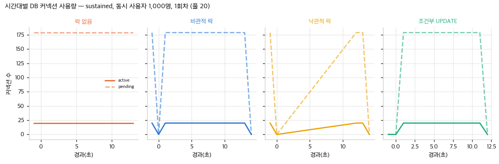
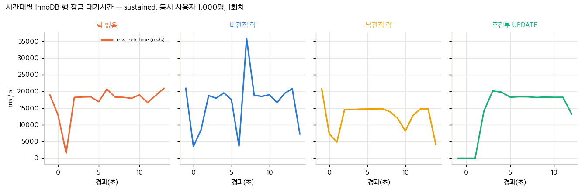

- HikariCP 풀 크기(EXP-03, 200 VU): 10 → 20 → 50 에서 비관적 락 TPS 522 → 445 → 407, p95 434 → 1,065 → 1,238 ms; 조건부 468 → 413 → 419 TPS, p95 460 → 1,183 → 1,416 ms. 행 잠금 1회당 대기 17 → 42 → 119 ms. 풀 확대는 핫로우 대기열만 늘린다.
- 발급 가능 vs 품절(EXP-05/06, 100 VU): 조건부 666 → 13,025 TPS(19.6배), 비관적 516 → 4,989 TPS(9.7배). 품절 경로에서 비관적 락은 요청마다 잠금(49,954회)을 잡아 다른 전략의 38% 처리량에 그친다.
- 낙관적 락 재시도와 응답시간: 재시도 20,565(10 VU) → 38,445회(1,000 VU)에 p95 93.8 → 4,985.8 ms. 재시도는 핫로우에서 스핀이 된다.

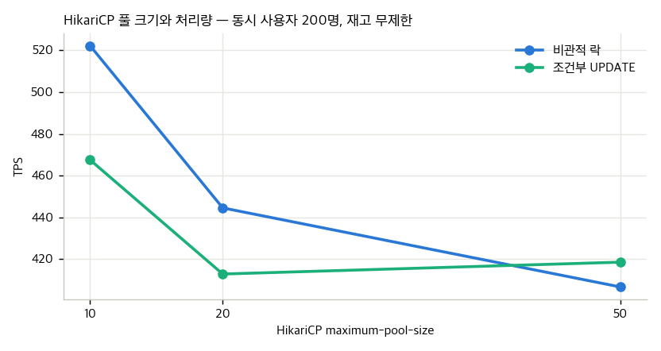
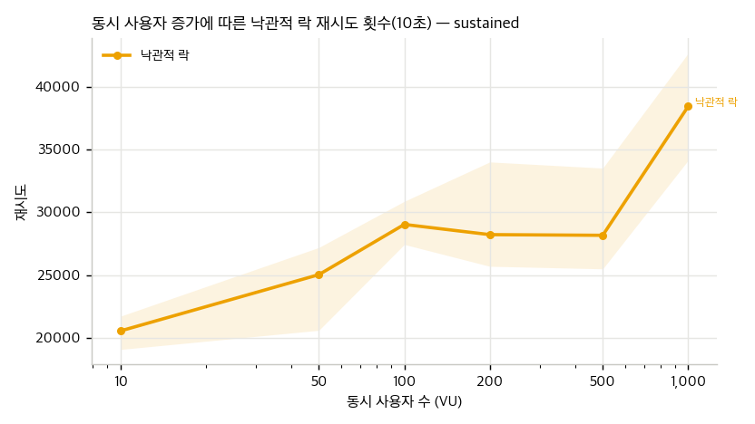

### 5.5 중복 요청 (EXP-02·04·07)

- 쿠폰 100개, 사용자 1,000명 × 2회(2,000건, 1,000 VU): 네 전략 모두 DB 중복 발급 0. 비관적·조건부의 409 는 0~15건인데, 2번째 요청 대부분이 품절 후 도착해 UNIQUE 검사보다 품절 경로(410)가 먼저 응답하기 때문이다.
- UNIQUE 제약을 제거하면 락 없음은 중복 1,000건, 조건부 UPDATE 도 5회 중 1회 5건의 중복이 생겼다. **중복 방지는 락 전략이 아니라 UNIQUE(coupon_id, user_id) 제약이 담당한다.**
- 재고가 남은 상태(쿠폰 10,000,000개, EXP-07)에서는 락 없음·비관적·조건부 모두 성공 정확히 1,000 / 409 정확히 1,000 / DB 1,000행으로 중복 0. 낙관적 락은 503 이 618건(31%)이라 성공 833·409 557 로 갈렸다(중복은 0).
- 같은 부하에서 UNIQUE 제약을 빼면 조건부 UPDATE 도 5회 모두 중복 1,000건(2,000건 전부 발급). 실험 후 제약을 재생성해 복구했다.

### 5.6 최종 선택

우선순위(초과 0 → 중복 0 → 불일치 0 → 서버 오류 → p95/p99 → 처리량 → 복잡도)로 보면:

| 기준 | 비관적 락 | 낙관적 락 | 조건부 UPDATE |
|---|---|---|---|
| 초과·중복·불일치 | 0 / 0 / 0 | 0 / 0 / 0 | 0 / 0 / 0 |
| 서버 오류 (1,000 VU) | 0% | 3.8% (지속 부하 30~66%) | 0% |
| p95 / p99 (coherence 1,000 VU) | 261 / 263 ms | 684 / 702 ms | 195 / 205 ms |
| TPS (coherence / 품절 / 지속 1,000 VU) | 2,590 / 5,373 / 623 | 1,259 / 12,366 / 286 | 3,442 / 14,233 / 1,132 |
| 구현·운영 복잡도 | FOR UPDATE 1줄, 락 대기 타임아웃 관리 | version 컬럼 + 재시도 루프 + 백오프 튜닝 | UPDATE 1문장 + 선조회, 재시도 없음 |

**조건부 UPDATE 를 최종 선택했다.** 정합성을 완전히 보장하면서 세 정합 방식 중 p95·p99·처리량이 가장 좋고, 재시도·버전 관리가 없어 가장 단순하다.
비관적 락은 정합성과 오류율에서 동급이지만 품절 경로가 2.6배 느리다. 낙관적 락은 핫로우 하나를 두고 재시도가 스핀이 되어 탈락.

Grafana 대시보드(실행 중 캡처): 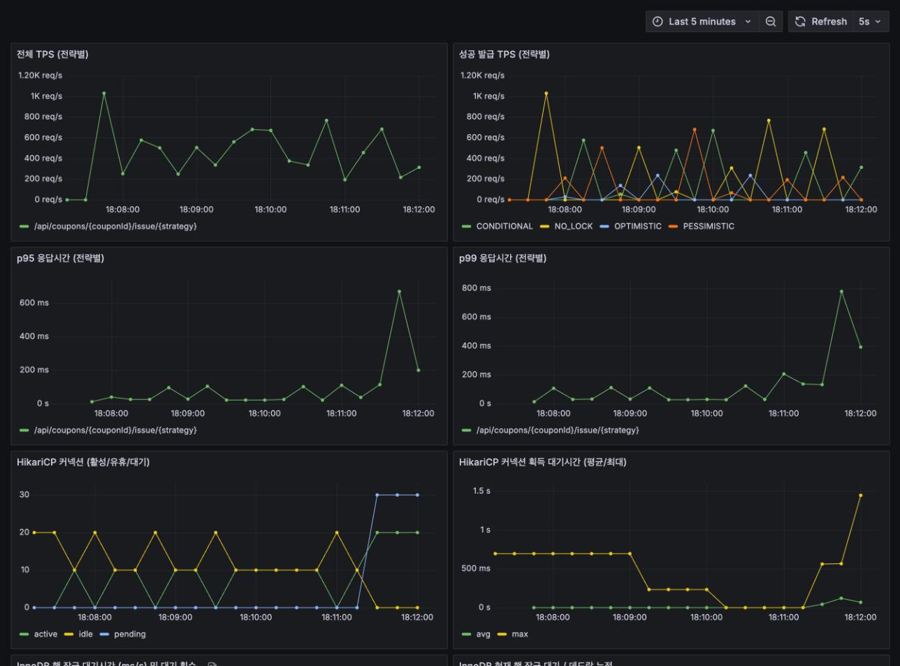 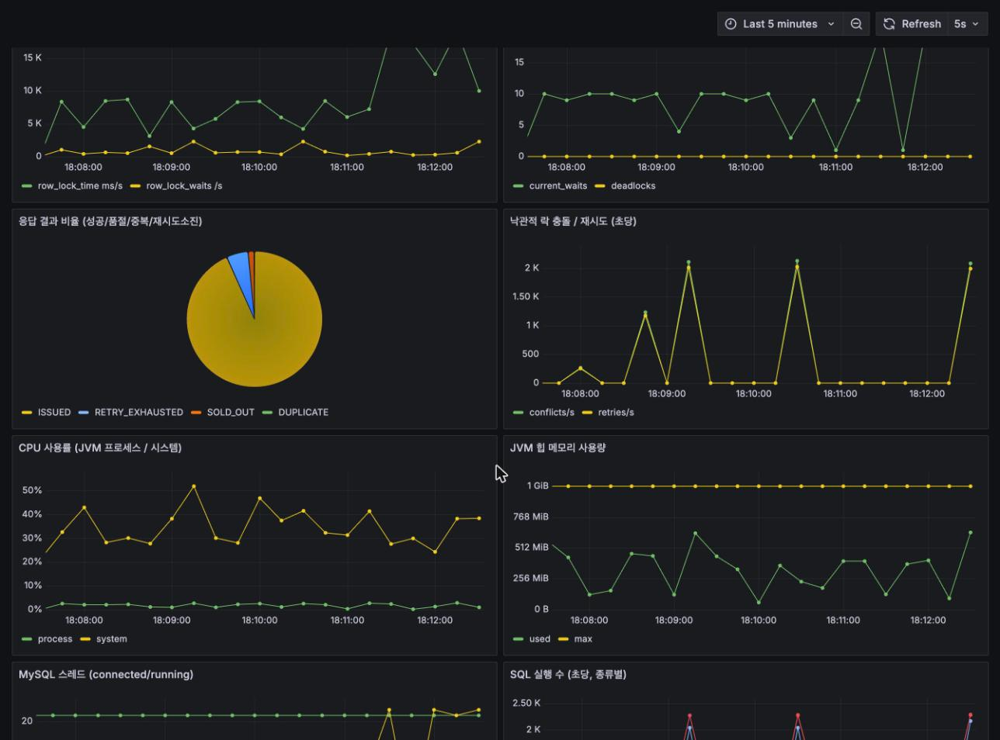

## 6. 실패한 접근과 개선 과정

1. **락 없음(기준)** — JPA 더티체킹과 같은 절대값 UPDATE. 10 VU 에서도 1,000건 전부 발급, 재고는 52. "동시성 문제는 트래픽이 많을 때만 생긴다"는 가정이 틀렸다.
2. **비관적 락** — 정합성 확보. 그러나 품절 판정에도 잠금을 잡아 품절 처리량이 5,000 TPS 에서 막히고, 1,000 VU 지속 부하 p95 3.3초.
3. **낙관적 락** — 정합성은 맞지만 재시도 20회로도 3.8%(선착순) ~ 66%(지속) 가 503. 백오프를 넣으면 응답시간이, 재시도를 늘리면 CPU 가 나빠지는 구조라 핫로우에는 부적합하다고 판단.
4. **조건부 UPDATE** — REPEATABLE READ 에서는 UPDATE 의 WHERE 조건에 맞지 않는 행도 커밋까지 잠기므로 UPDATE 를 먼저 두면 품절 요청까지 핫로우를 잠근다. 그래서 처음부터 무잠금 선조회 → INSERT → UPDATE(마지막) 순서로 구현해 잠금 보유 구간을 UPDATE~COMMIT 으로 줄였다. UPDATE 를 먼저 두는 변형은 측정하지 않았다(한계).
5. **풀 크기 확대** — 커넥션 대기가 보여서 풀을 50 으로 늘려 봤지만 행 잠금 대기가 3배가 되고 p95 가 나빠졌다(EXP-03). 병목은 커넥션이 아니라 핫로우였다.
6. **측정 파이프라인의 실패**
   - 1,000 VU 연속 실행 후 macOS 임시 포트 소진(TIME_WAIT, errno 49)으로 mysql 초기화와 k6 연결이 실패해 세 실험이 기록 0건, 1,000 VU 4·5회차가 오염됐다 → 오염 기록 삭제 후 `wait_ports`(TIME_WAIT 3,000개 미만까지 대기)와 mysql 재시도를 넣고 재측정.
   - `performance_schema` 다이제스트에 앱 SQL 이 안 잡혔다 → 서버 사이드 프리페어드 스테이트먼트 옵션 때문이라 Connector/J 기본값(클라이언트 PS)으로 되돌림.
   - `docker stats` 스트림의 ANSI 커서 코드 때문에 MySQL CPU 가 비어 있었다 → 파서 수정 후 원시 파일에서 재집계.
   - 재집계 스크립트가 실행 중인 배치의 `runs.jsonl` 을 덮어쓸 뻔했다 → 원시 파일(`results/*/raw`)을 진실 소스로 삼고 집계는 파생물로만 취급.
7. **데드락 분류 버그 (웹 UI 를 만들다 발견)** — Spring 6 이후 기본 예외 번역기(`SQLExceptionSubclassTranslator`)는 MySQL 데드락(오류 1213, SQLState 40001)을 `DeadlockLoserDataAccessException` 이 아니라 `CannotAcquireLockException` 으로 던진다. 그래서 컨트롤러의 데드락 catch 는 한 번도 실행되지 않았고 `coupon_deadlock_total` 은 구조적으로 0 이었다. 실험 기간의 `coupon_error_total` 은 전 구간 0 이고 표의 '데드락(InnoDB)' 은 `INNODB_METRICS` 에서 따로 읽은 값이라 결과 수치는 그대로다. 벤더 코드 1213 으로 구분하도록 고쳤다.
   - 시연 실행기의 초기화를 `DELETE` 로 했을 때 앱 재시작 직후 첫 조건부 UPDATE 실행에서 데드락 1건(`lock_deadlocks`=1, 5xx 1건)이 났다. 삭제 표시된 UNIQUE 레코드에 같은 키를 다시 INSERT 하며 걸리는 갭 락이 핫로우 UPDATE 와 맞물린 것으로 추정한다. 벤치와 같은 `TRUNCATE` 로 바꾼 뒤 3회 재실행에서 재현되지 않았다.

## 7. 한계

- 앱·k6·Docker VM 이 한 장비(10코어)를 나눠 쓴다. 5회 반복 TPS 변동계수 10~25%, p99 는 더 크다. 절대값보다 방식 간 상대 비교와 추세를 신뢰한다.
- MySQL 은 Docker 볼륨 위에서 `innodb_flush_log_at_trx_commit=1` 로 커밋마다 fsync 한다. 성공 1건당 약 1.6 ms 의 직렬 구간은 이 환경의 fsync 지연을 포함한 값이다.
- Prometheus 1초 스크레이프라 1초 안에 끝나는 실행(coherence 저 VU)의 커넥션·CPU 시계열은 신뢰하지 않았다.
- 쿠폰 1종(핫로우 1개)만 다뤘다. 재고 분할·Redis 선판정·큐잉은 측정하지 않았다.
- 재시도 백오프 없음, Tomcat 200 스레드 고정 등 설정은 한 값만 실험했다.

## 8. 이력서 문장 (실측값)

```text
동시 요청 1,000건에서 발생하던 초과 발급 문제(쿠폰 100개에 1,000건 발급)를 재현하고,
비관적 락·낙관적 락·조건부 UPDATE 를 동일한 환경에서 비교했습니다.
최종적으로 조건부 UPDATE 를 적용하여 초과 및 중복 발급을 0건으로 유지하면서
p95 응답시간을 261 ms 에서 195 ms 로 단축하고 처리량을 2,590 TPS 에서 3,442 TPS 로 개선했습니다.
```

(쿠폰 100개 / 서로 다른 사용자 1,000명 / 동시 사용자 1,000명, 5회 중앙값, 변경 전 = 비관적 락. 지속 부하 1,000 VU 기준으로는 p95 3,316 → 1,817 ms, 623 → 1,132 TPS.)

